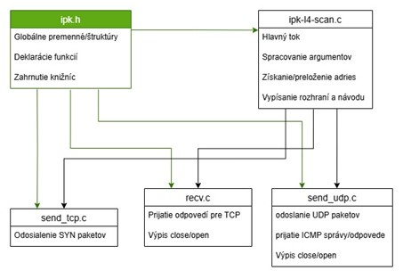

# IPK-L4-Scan

## 1. Úvod
IPK-L4-Scan je nástroj na skenovanie sieťových portov pomocou protokolov TCP a UDP cez IPv4 a IPv6. Podporuje nasledujúce techniky:

- **TCP SYN skenovanie**: Odosiela TCP SYN pakety a analyzuje odpovede.
  - SYN-ACK → otvorený port
  - RST-ACK → zatvorený port
- **UDP skenovanie**: Odosiela UDP pakety a sleduje odpovede.
  - ICMP Port Unreachable → zatvorený port
  - Nedostatok odpovede → port môže byť otvorený (považuje sa za otvorený)
- **Použitie raw socketov**: Umožňuje prijímanie a odosielanie sieťových paketov na nízkej úrovni.
- **Použitie knižnice pcap**: Slúži na získanie dostupných sieťových rozhraní.

## 2. Architektúra a kľúčové komponenty
Aplikácia je implementovaná v jazyku C a pozostáva z nasledujúcich súborov:

- **ipk.h** – Deklarácie globálnych premenných, pseudo-headerov a funkcií na odosielanie a prijímanie paketov.
- **ipk-l4-scan.c** – Hlavný súbor, spracovanie argumentov a spustenie skenovania.
- **recv.c** – Prijímanie a spracovanie odpovedí (pre TCP).
- **send_tcp.c** – Odosielanie TCP SYN paketov pre IPv4 a IPv6, výpočet kontrolných súm.
- **send_udp.c** – Odosielanie UDP paketov pre IPv4 a IPv6 a analýza odpovedí.
  
<p align="center">
  
</p>

  **Obrázok 1**: Diagram ukazujúci architektúru aplikácie.

### Použité knižnice
Aplikácia využíva štandardné knižnice na prácu so sieťou:

`stdio.h, stdlib.h, string.h, errno.h, unistd.h, sys/types.h, sys/socket.h, netinet/in.h, arpa/inet.h, netinet/ip.h, netinet/tcp.h, netinet/ip6.h, ifaddrs.h, sys/time.h, pthread.h, netdb.h, pcap.h, semaphore.h`

## 3. Zaujímavé časti kódu

- **Funkcie `send_ipv4` a `send_ipv6`** (v `ipk-l4-scan.c`)
  - Paralelné vlákna na odosielanie a prijímanie TCP/UDP paketov.
- **Funkcie `send_syn_packet` a `send_syn_packet_ipv6`** (v `send_tcp.c`)
  - Vytváranie a odosielanie TCP SYN paketov.
- **Funkcie `send_udp_packet` a `send_udp_packet_ipv6`** (v `send_udp.c`)
  - Vytváranie a odosielanie UDP paketov a prijímanie odpovedí.
- Využitie semaforov na zabránenie race condition pri opätovnom odosielaní SYN paketov.

## 4. Testovanie a validácia

### Testovacie prostredie
- **Operačný systém**: Ubuntu 64-bit
- **Testované ciele**:
  - Loopback (`127.0.0.1`, `::1`)
  - Externé testovacie servery (`scanme.nmap.org`)

### Testovacie prípady
#### a) Skenovanie otvoreného portu
Príkaz:
```sh
./ipk-l4-scan -i lo -t 4000 localhost
```
Očakávaný výstup:
```
127.0.0.1 4000 tcp open
::1 4000 tcp closed
```
Skutočný výstup:
```
127.0.0.1 4000 tcp open
::1 4000 tcp closed
```

#### b) Skenovanie zatvoreného portu
Príkaz:
```sh
./ipk-l4-scan -i enp0s3 -t 9999 45.33.32.156
```
Očakávaný výstup:
```
45.33.32.156 9999 tcp closed
```
Skutočný výstup:
```
45.33.32.156 9999 tcp closed
```

#### c) IPv6 skenovanie
Príkaz:
```sh
./ipk-l4-scan -i lo --pt 22 ::1
```
Očakávaný výstup:
```
::1 22 tcp closed
```
Skutočný výstup:
```
::1 22 tcp closed
```

## 5. Dokumentácia
Dokumentácia je dostupná v súbore `README.md`. Implementované funkcie a známe obmedzenia sú popísané v `CHANGELOG.md`.

## 6. Licencia
Tento projekt je dostupný pod licenciou MIT.

